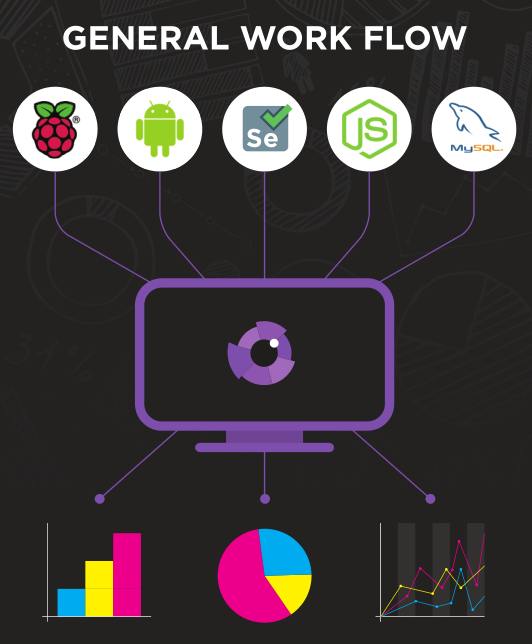
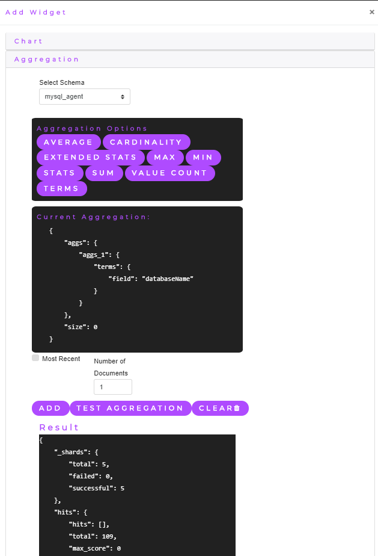

    

        
    

# Iris

This repository contains the core code for my final year project, Iris. The aim of this project is to design a full implementation of a system for application performance monitoring. Iris provides users with a dynamic performance framework which allows users to fully customise and centralise their application performance monitoring.  This is achieved through a web interface where a user specifies a schema for a specific application they wish to monitor. Once a schema has been set up, a REST endpoint is generated for the application.  This endpoint allows a user to send their monitoring data from their desired application to the framework in the form of JSON (matching the specified schema). Iris also contains features which allow a user to monitor and analyse incoming data, using an intelligent, fully customisable graph and dashboard builder.  Iris then visualises any received data in real time to appropriate dashboards using websockets.

## General Workflow
The following images captures the general workflow of Iris.
 

## Features List
The features of Iris follow closely to that of Kibana. Iris adds some extra features which Kibana does not support, these are as follows:
* Real-Time Monitoring
* Elasticsearch Aggregation Builder
* Automatic Elasticsearch Mapping
* Elasticsearch Aggregation Playground
* Centralised Data Transformation
* User Specific Dashboards
* Dashboard Builder
* Dashboard Revision History
* Unique Application Endpoint Generation

Iris currently supports several types of data, they are as follows:
* Numerical
* Categorical
* Raw
* State Based

## Elasticsearch
Iris uses Elasticsearch to to do data aggregations on incoming data. Iris comes with an Elasticsearch aggregation playground which allows users to build Elasticsearch aggregations through a user friendly UI. The aggregation playground allows users to test out aggregations before associating them with charts on their dashboards. An example of the elasticsearch aggregation builder being generated for a chart is show below. In the image you can see the json for the aggregation being generated as the user uses the UI.
 

## Iris Video Demonstration
Iris is a large system and it is difficult to capture all of the details in a single readme file, the quickest way to understand the system is to watch a quick video demonstration on Iris ([Iris Video Demo](https://www.youtube.com/watch?v=_4BrCjIJeNk)).

## Iris Presentation
A presentation on Iris can be found [here](https://docs.google.com/presentation/d/1hVUR8WAre52-dlXGmbzmUwJK9PCOiS0Z_uR8PyuRilw/edit?usp=sharing).

## Iris Poster
The poster that was used for Iris at the W.I.T industry day can be found [here](https://drive.google.com/file/d/1BZMQUfYcGy-KQV87PGrVrMMxZLu7kgyW/view?usp=sharing).

## Iris Documentation Report
Iris was created as a final year project and has many features which are not discussed in this readme file. For in depth information on the system it is recommended that you read the reports created for Iris. These can be found in the [iris-report](https://github.com/DeanGaffney/iris-report) repository.

The semester 1 report covers the motivation, planning and designing of Iris.

The semester 2 report covers the implementation of Iris and the Iris agents that were used to demonstrate the functionality of Iris.

## Iris agents
There was five agents created to demonstrate the versatility of Iris, they are as follows:

* [Android](https://github.com/DeanGaffney/iris-android)
* [Selenium](https://github.com/DeanGaffney/iris-selenium)
* [Node.js](https://github.com/DeanGaffney/iris-node)
* [MySQL](https://github.com/DeanGaffney/iris-mysql)
* [Crypto Currency Rates](https://github.com/DeanGaffney/iris-crypto-rates)

## Built With

* Grails

## Authors

* **Dean Gaffney** - *Design, Code* 
* **Kieran Murphy** - *Supervisor*
* **[Shane Nolan](https://github.com/shanenolanwit)** - *Design, Supervisor*

See also the list of [contributors](https://github.com/DeanGaffney/iris/graphs/contributors) who participated in this project.
